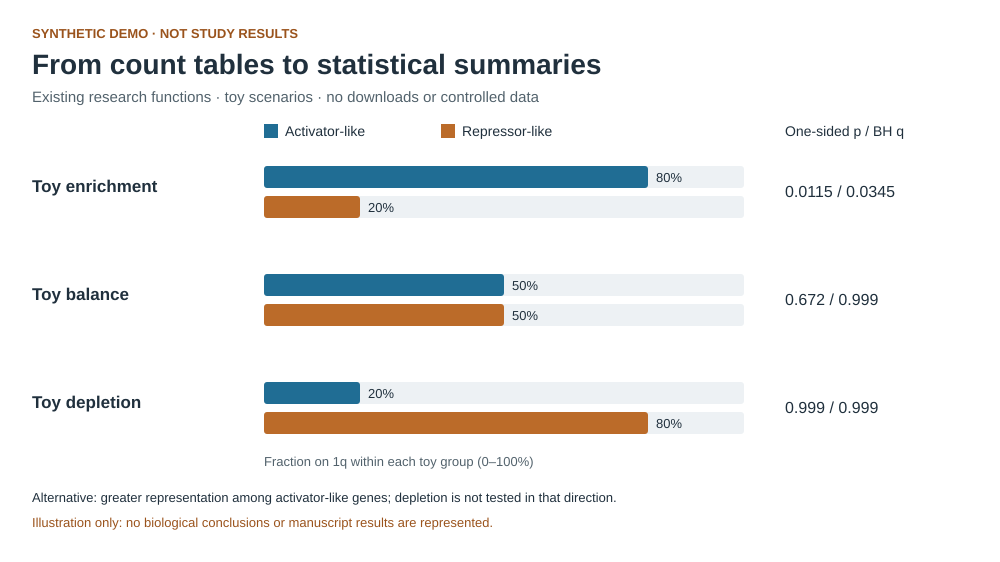

# SF3B4 and chromosome 1q gain in Ewing sarcoma

Research code connecting **cancer genomics, clinical outcome analysis, transcriptomics and network-based driver prioritization** to investigate chromosome 1q gain and SF3B4 in Ewing sarcoma.

New here? Start with the overview below, or run the [offline synthetic demo](demo/README.md) in one command. The demo needs only Python and does not use patient data.

## The research question

Chromosome-arm gains affect many genes at once. Which molecular changes accompany 1q gain, how does it relate to clinical outcomes, and which genes warrant functional follow-up?

This repository brings together complementary analyses addressing those questions: cohort-level copy-number and survival analyses, differential expression and pathway enrichment, network-based prioritization, and analysis of SF3B4 perturbation experiments.

### Research context

This project forms part of **Angelina Yershova's doctoral research at DKFZ/KiTZ**. It reflects work at the interface of computational cancer biology and experimental follow-up, using R/Bioconductor, Python and shell workflows. The associated study is collaborative; see [AUTHORS.md](AUTHORS.md) for the manuscript author list, rather than interpreting this repository as sole authorship of every analysis.

[LinkedIn](https://www.linkedin.com/in/angelina-yershova/) · [ORCID](https://orcid.org/0000-0002-2686-8399)

## Try a small, runnable example

With **Python 3.10 or newer**, from the repository root:

```bash
python3 demo/run_demo.py
python3 -m unittest discover -s tests -v
```

The demo validates an invented count table, calls the repository's existing one-sided Fisher exact test and Benjamini–Hochberg correction, and writes a CSV summary and an SVG preview to `demo/output/`. It uses only the Python standard library: no installation, network access or external datasets are needed.



**All demo counts are invented.** This example illustrates the statistical workflow; it does not reproduce a manuscript figure, establish a biological result or validate the complete research pipeline. See [demo documentation and reference outputs](demo/README.md).

## Explore the research analyses

| Module | Focus |
| --- | --- |
| [01 · Pan-cancer 1q](01_pan_cancer_1q/) | Chromosome 1q context and pathway-level analyses |
| [02 · Ewing CNA and survival](02_ewing_cna_survival/) | Copy-number alterations, survival models and relapse enrichment |
| [03 · Transcriptome and stemness](03_inform_transcriptome_stemness/) | INFORM differential expression, enrichment and stemness |
| [04 · Driver prioritization](04_netbid2_driver_prioritization/) | NetBID2 network-based prioritization and DepMap annotation |
| [05 · Perturbation and proteomics](05_sf3b4_perturbation_proteomics/) | SF3B4 perturbation and proteomic analyses |
| [06 · Xenograft growth](06_xenograft_growth/) | Analysis of SF3B4 xenograft growth experiments |

Each folder includes analysis scripts, a README and a `run.sh` wrapper. Full research analyses require the appropriate external inputs and software; they are separate from the self-contained demo.

## Running the research workflows

1. Review the [dependency notes](docs/DEPENDENCIES.md) and install the required software.
2. Check the [external-input manifest](docs/EXTERNAL_INPUTS.md) and obtain any necessary access permissions.
3. Set the input paths documented in the [expanded command blocks](docs/MANUSCRIPT_TOPIC_CODE_BLOCKS.md).
4. Run the relevant topic wrapper.

Without the required environment variables, wrappers skip controlled-data and public-download steps by default. For example:

```bash
# Inspect the default skip behaviour; does not opt into downloads.
bash 01_pan_cancer_1q/run.sh

# Explicitly opt into the public-download steps when ready.
RUN_PUBLIC_DOWNLOADS=1 bash 01_pan_cancer_1q/run.sh
```

### What the automated checks cover

The [check workflow](.github/workflows/checks.yml) runs the offline demo tests and syntax checks for Python, R and shell scripts. Tests exercise the demo, selected statistical functions and a toy signed-pathway graph. They do **not** execute the full controlled-data analyses or certify scientific conclusions. `environment.yml` is a dependency starting point, not a fully locked environment.

## Data access and responsible reuse

Patient-level, controlled-access and raw experimental inputs are not distributed here. Documentation records required filenames and access boundaries, without their contents. Only explicitly labelled synthetic demo inputs and previews are included. See the [data policy](docs/DATA_POLICY.md) and [code availability statement](docs/CODE_AVAILABILITY.md).

Please do not include confidential data in issues or pull requests.

## Citation and project metadata

- Current version: **0.1.0**; see [VERSION](VERSION) and [CHANGELOG.md](CHANGELOG.md).
- License: [MIT](LICENSE).
- Authorship and citation: [AUTHORS.md](AUTHORS.md) and [CITATION.cff](CITATION.cff).
- Release preparation: [release checklist](docs/RELEASE_CHECKLIST.md) and [Zenodo metadata template](.zenodo.json).

The current repository metadata does not supply a manuscript DOI or preprint link. Please use the available code citation metadata and check for updates before citing the associated study.
